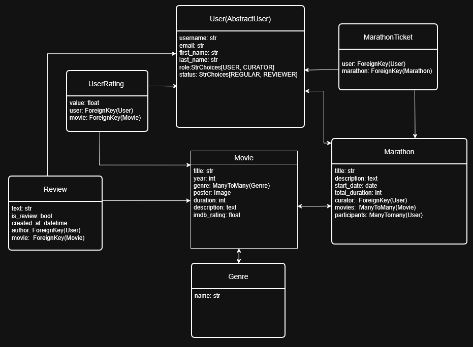

# Movie Marathon

Movie Marathon is a web application for browsing and rating movies, as well as organizing movie nights. Users can create accounts, view movies, leave ratings, write comments, and schedule movie marathons with friends. This project was developed using Python 3.13 and Django 6.0.

---

## Features

* User registration and login
* Browse movie list and detailed information
* Rate movies
* Add comments and reviews
* Schedule and organize movie nights

---

## How to Run

1. Clone the repository from GitHub
```bash
git clone your-forked-repo-link
```

3. Open the project folder in your IDE
4. Open a terminal in the project folder
5. Create a branch for your work and switch to it

```bash
git checkout -b develop
```

6. If your IDE did not automatically create a virtual environment:

```bash
python -m venv venv
venv\Scripts\activate   # on Windows
source venv/bin/activate # on macOS/Linux
pip install -r requirements.txt
```

7. Run the project:

```bash
python manage.py runserver
```

---

## Test Users

| Username  | Password    |
| --------- | ----------- |
| Bob (No permisions until you create 10 comments) | 123qweAA |
| Jane (All permissions (including creating parathons) ) | 123qweAA |

---

## Project Structure

```
movie-marathon/
├── marathons/            # Application for organizing movie nights
│   ├── migrations/
│   ├── __init__.py
│   ├── admin.py
│   ├── apps.py
│   ├── forms.py
│   ├── models.py
│   ├── urls.py
│   └── views.py
├── movies/               # Main application for movies
│   ├── migrations/
│   ├── management/commands/
│   ├── __init__.py
│   ├── admin.py
│   ├── apps.py
│   ├── models.py
│   ├── urls.py
│   └── views.py
├── users/                # User authentication and management
│   ├── migrations/
│   ├── __init__.py
│   ├── admin.py
│   ├── apps.py
│   ├── forms.py
│   ├── models.py
│   ├── urls.py
│   ├── utils.py
│   └── views.py
├── movie_marathon/       # Main project configuration
│   ├── __init__.py
│   ├── asgi.py
│   ├── assets/
│   ├── settings.py
│   ├── urls.py
│   ├── views.py
│   └── wsgi.py
├── static/               # Static files (CSS, JS)
│   ├── css/
│   └── js/
├── templates/            # HTML templates
│   ├── includes/
│   ├── marathons/
│   ├── movies/
│   └── registration/
├── tests/                # Unit tests
├── manage.py
├── requirements.txt
└── README.md
```



---

## License
This project does not have a specific license at the moment. All rights reserved by the author.
